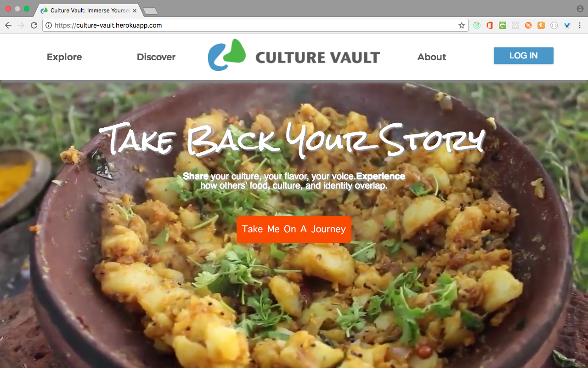
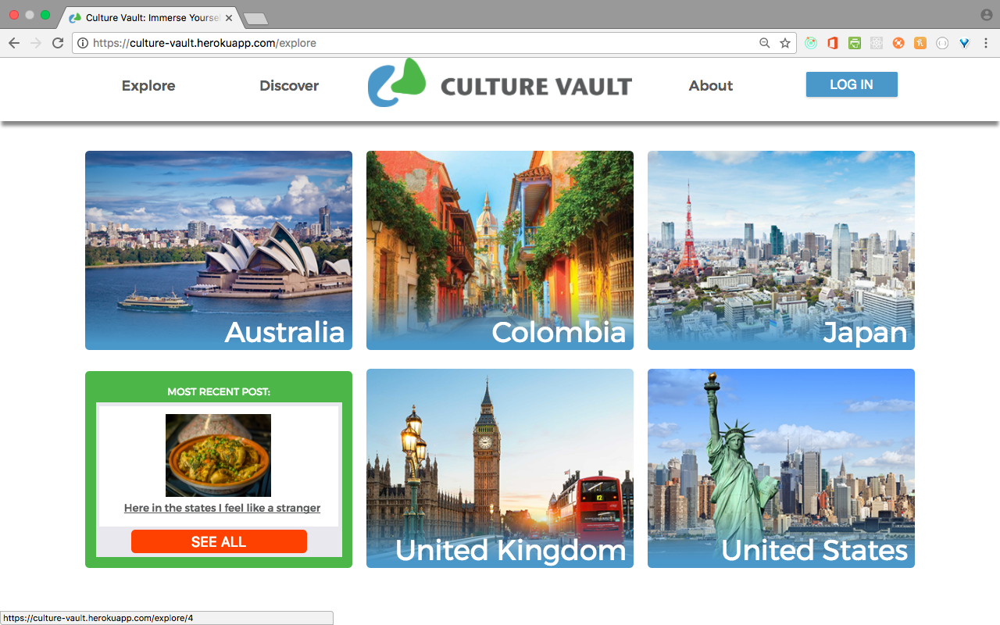
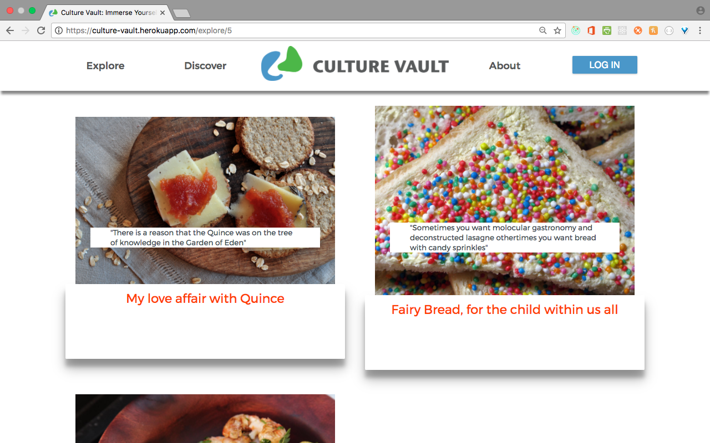
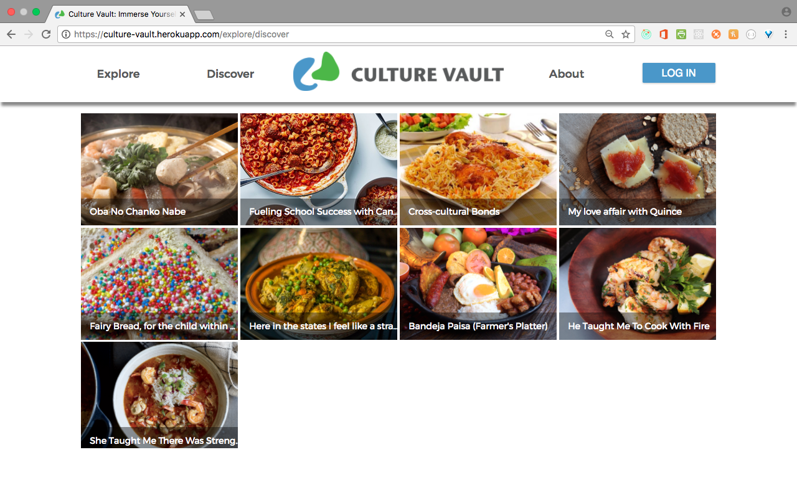
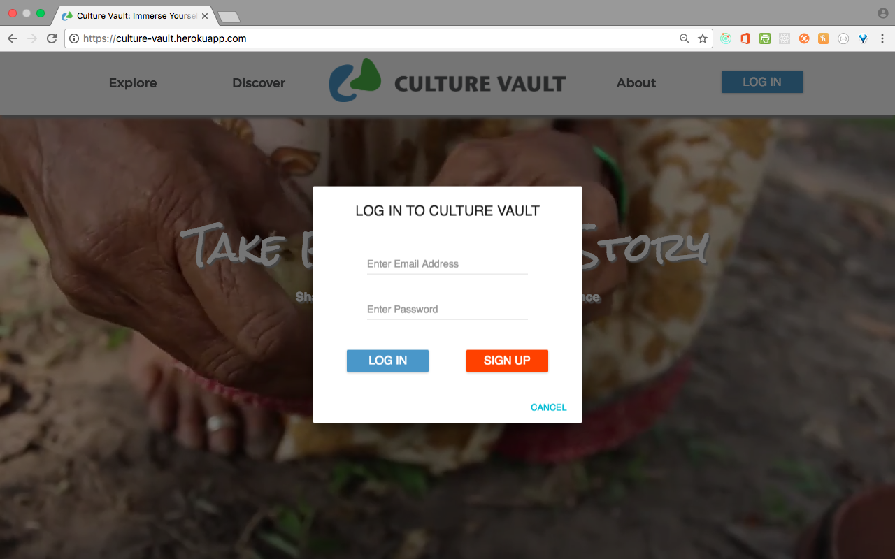
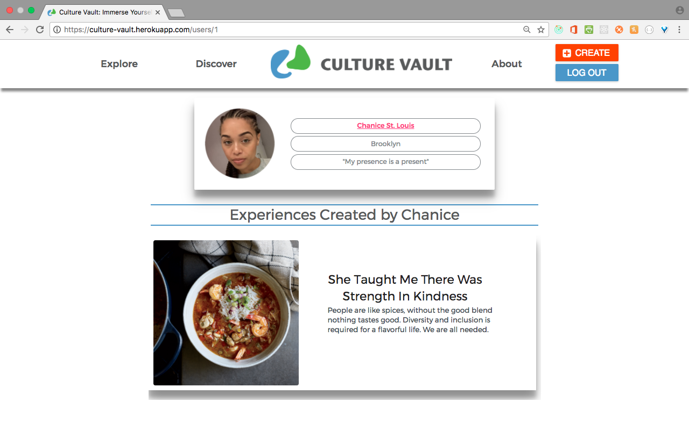
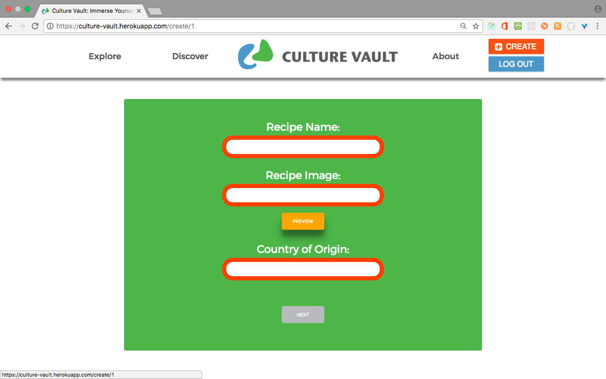

* Culture Vault Tech Reference: https://gist.github.com/#

* Live Demo: https://culture-vault.herokuapp.com

* Culture Vault Video Demo: https://vimeo.com/#

* Code Style:

    - React: https://github.com/facebook/react/wiki/Complementary-Tools
    - Redux: https://github.com/ghengeveld/react-redux-styleguide
    - ES5: https://github.com/airbnb/javascript

## Description

Culture Vault is a social media platform that elevates the variety and richness of ethnic food-ways by sharing stories inspired by home-cooked meals, cookbooks, restaurants, sites, & travel.

## How does it work?

All Visitor's are able to browse posted Food Experiences.
Once new members fill the 'user profile' form, the explore screen changes to allow them the opportunity to post their Food Experiences.
The Food Experiences are stored on our database and searchable by the members' username or by location.

## How to run 'Culture Vault' locally:

* Step 1. Install Postgres, Postico and Node.js

    - Install Postgres, Postico and Node.js
    - Create a new `database` named *culture_vault* in Postico for Postgres store data
    - Connect using Postico to *culture_vault*

* Step 2. Get Culture Vault source code and install package

    - Clone Culture Vault from github: $ **git clone** https://github.com/Ormabe/culture_vault.git
    - Go into culture_vault folder and install node package: **cd culture_vault && npm install**

* Step 3. Populate seed data from file

    - **node backend/server/populateData.js**

* Step 4. Create an `.env` file at your root directory. Set your **SECRET LOGIN SECURITY KEY**, the demo was designed with a 24-digit password. You can generate a truly random secret key yourself: https://lastpass.com/generatepassword.php

    - SECRET_LOGIN_KEY=**Replace with your new 24-digit password**

* Step 5. Turn on **PostgreSQL**

* Step 6. Create a new database in **Postico** named `culture_vault`.

* Step 7. Create a `config.json` file in the `backend/server/config` folder.

    - Insert the following code into the newly created `config.json` file:

    ```JSON
        {
          "development": {
            "username": "root",
            "password": null,
            "database": "culture_vault",
            "host": "127.0.0.1",
            "dialect": "postgres"
          },
          "test": {
            "username": "root",
            "password": null,
            "database": "culture_vault",
            "host": "127.0.0.1",
            "dialect": "postgres"
          },
          "production": {
            "username": "root",
            "password": null,
            "database": "culture_vault",
            "host": "127.0.0.1",
            "dialect": "postgres"
          }
        }
    ```
    - Replace `"root"` with the name that appears before the `$` in your terminal.

* Step 8. Start the server

    - Run culture_vault: **npm start**

* Step 9. Pull up Culture Vault in your browser

    - http://localhost:2222/

## Technologies

Back-end (for MAC):

* [Node.js](https://nodejs.org/en/)
* [Postgres](https://postgresapp.com/)
* [Postico](https://eggerapps.at/postico/)
* [Express](http://expressjs.com/)
* [Sequelize](http://docs.sequelizejs.com/en/v3/)
* [Passport](http://passportjs.org)
* [BCrypt](https://github.com/shaneGirish/bcrypt-nodejs)
* [DotEnv](https://www.npmjs.com/package/dotenv)


Front-end:

* [React.js](https://facebook.github.io/react/)
* [Redux](http://redux.js.org/)
* [React Router](https://www.npmjs.com/package/react-router)
* [Sass](http://sass-lang.com/guide)
* [Material-UI](http://www.material-ui.com/#/)

## CRUD App

This is a simple web-based app that uses restful API to create, retrieve, update and delete information from your PostgresSQL data directory, using PostgresSQL, Sequelize, Express.js, and Node.js

- **PostgreSQL** is a powerful, open source object-relational database system. It has more than 15 years of active development and a proven architecture that has earned it a strong reputation for reliability, data integrity, and correctness. It runs on all major operating systems, including Linux, UNIX (AIX, BSD, HP-UX, SGI IRIX, Mac OS X, Solaris, Tru64), and Windows. It is fully ACID compliant, has full support for foreign keys, joins, views, triggers, and stored procedures (in multiple languages). It includes most SQL:2008 data types, including INTEGER, NUMERIC, BOOLEAN, CHAR, VARCHAR, DATE, INTERVAL, and TIMESTAMP. It also supports storage of binary large objects, including pictures, sounds, or video. It has native programming interfaces for C/C++, Java, .Net, Perl, Python, Ruby, Tcl, ODBC, among others, and exceptional documentation.

- **Node.js** is an open-source, cross-platform JavaScript runtime environment for developing a diverse variety of tools and applications

- **Postico** is a modern database app for your Mac. Postico is the perfect tool for data entry, analytics, and application development

- **Sequelize** is a promise-based ORM (Object-Relational Mapping) for Node.js. It supports the dialects PostgreSQL, MySQL, MariaDB, SQLite and MSSQL and features solid transaction support, relations, and read replication.

- **Express.js** or simply Express, is a web application framework for Node.js, released as free and open-source software under the MIT License. It is designed for building web applications and APIs. It is the de facto standard server framework for Node.js.

- **Passportjs** An authentication middleware for Node.js.

- **BCrypt** An adaptive hash function based on the Blowfish symmetric block cipher cryptographic algorithm.

- **Material-UI** A Set of React Components that Implement Google's Material Design.

## Using the Culture Vault App

___
 **Welcome Screen** Users are greeted by the welcome screen, where they are able to login, or explore the multi-sensory experiences.



___
 **Explore** Users can explore all of the multi-sensory experiences without a log-in.



___
 **Experiences By Country** On this page our users can explore experiences submitted by other users, sorted by country. Each country shows a featured experience, that highlights the most recently submitted experience for that country. There is also a button where the user can select all the experiences for that country.



___
 **Discover** If the user is more interested in looking at all of the experiences at once, they have the option of viewing all experiences at once.



___
 **Login or Sign Up** Users also have the option of creating an account which allows them to create their own culturally-relevant experiences. If they already have an account, they can simply login.



___
 **User Profile** Once users have created an account or logged into their existing account, they are directed toward their User Profile page, where they can see the experiences they previously created, or the experiences from other Culture Vault users that they had previously liked.



___
 **Create Experience** Only once the user is logged in do they get the option to create an experience.



## Credits

To our awesome core team with help of our contributors which have made this project a success.

* [Victor Amos, Technical Lead](https://github.com/victoramosjr)
* [Niko Lewis, Demo Lead](https://github.com/NikoLewis)
* [Chanice St. Louis, SCRUM Master](https://github.com/ChaniceStl)
* [Rabiya Watson, Project Manager](https://github.com/Ormabe)

## Special Thanks

* [Christopher Taylor Edwards, ThoughtWorks, Design Mentor](https://www.linkedin.com/in/christophertayloredwards)
* [Paul Hine, Coalition for Queens (C4Q), Technical Volunteer](https://www.linkedin.com/in/mrhpaul)
* [Charles Kuang, C4Q, Web Instructor](https://www.linkedin.com/in/charleskuang)
* [Nate Maddrey, C4Q, Web Instructor](https://www.linkedin.com/in/natemaddrey/)
* [Tao Ning, LinkedIn, Technical Mentor](https://www.linkedin.com/in/tao-ning)
* [Kevin Stewart, LinkedIn, Technical Mentor](https://www.linkedin.com/in/stewartkevin)

## For more information about using Node.js, see these Dev Center articles:

* Best Practices for Node.js Development: https://www.codementor.io/mattgoldspink/nodejs-best-practices-du1086jja
* Node Hero - Getting Started with Node.js: https://blog.risingstack.com/node-hero-tutorial-getting-started-with-node-js/
